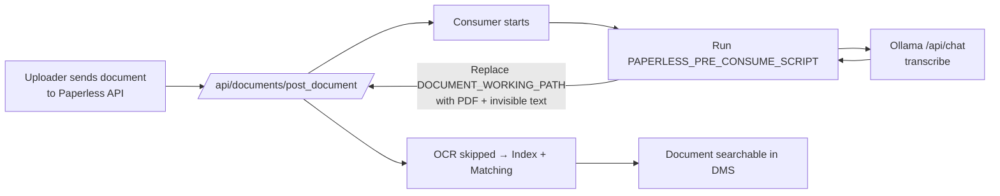

## Flowchart — Local Orchestration

```mermaid
flowchart LR
    W[Watch scans folder<br/>JPEGs detected] --> T[Ollama /api/chat<br/>transcribe image]
    T --> O[Create PDF with invisible text<br/>#40;PyMuPDF render_mode=3#41;]
    O --> M[Extract metadata<br/>#40;date, merchant, amount#41;]
    M --> R[Rename image + PDF<br/>YYYY-MM-DD_Merchant_id]
    R --> U[Upload to Paperless-ngx<br/>/api/documents/post_document/]
    U --> P[Resolve document id<br/>task/doc lookup]
    P --> PT[PATCH tags to exact set<br/>/api/documents/#123;id#125;]
    PT --> IDX[Paperless indexing<br/>OCR skipped #40;text embedded#41;]
    IDX --> D[Document searchable<br/>in DMS]
```

## Sequence — Local Orchestration

```mermaid
sequenceDiagram
    autonumber
    participant SL as ScanEventListener
    participant O as Ollama &#40;Vision&#41;
    participant PDF as PDF Overlay &#40;PyMuPDF&#41;
    participant X as Metadata Extractor
    participant P as Paperless API
    participant IDX as Index/Matcher

    SL->>SL: Detect new JPEG in watch dir
    SL->>O: POST /api/chat &#40;image as base64, instruction#41;
    O-->>SL: Transcript text
    SL->>PDF: Create PDF with invisible text #40;rendermode=3#41;
    SL->>X: Extract metadata &#40;heuristic#59; fallback LLM on PDF&#41;
    SL->>P: POST /api/documents/post_document/ &#40;multipart + fields&#41;
    P-->>SL: 201/202 + payload &#40;doc/task&#41;
    SL->>P: Resolve doc id &#40;direct/task/title search&#41;
    SL->>P: PATCH /api/documents/&#123;id&#125; &#123; tags: [...] &#125;
    P->>IDX: OCR skipped &#40;text embedded&#41; → index + matching
    IDX-->>SL: Document stored and searchable
```

## Alternative — Pre‑Consume Hook (Paperless)

```mermaid
flowchart LR
    A[Uploader sends document
to Paperless API] --> B[/api/documents/post_document/]
    B --> C[Consumer starts]
    C --> H[Run PAPERLESS_PRE_CONSUME_SCRIPT]
    H --> V[Ollama /api/chat
transcribe]
    V --> H
    H -->|Replace DOCUMENT_WORKING_PATH
with PDF + invisible text| B
    B --> IDX[OCR skipped → Index + Matching]
    IDX --> D[Document searchable in DMS]
```

