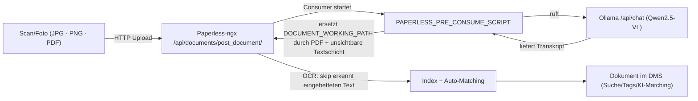
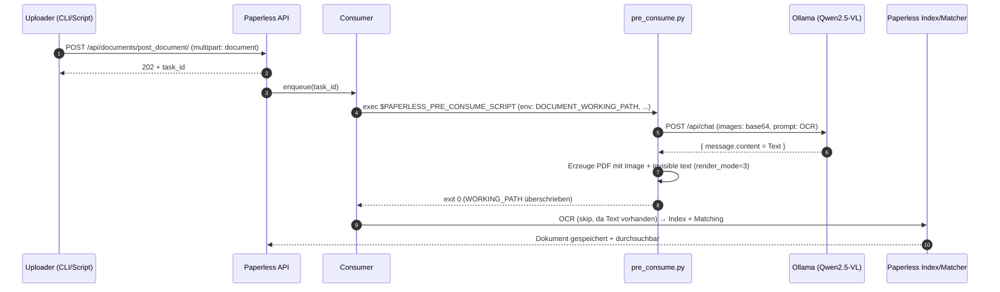

## Flowchart

```mermaid
flowchart LR
    A["Scan/Foto #40;JPG · PNG · PDF#41;"] -->|HTTP Upload| B["Paperless-ngx /api/documents/post_document/"]
    B -->|Consumer startet| C["PAPERLESS_PRE_CONSUME_SCRIPT"]
    C -->|ruft| D["Ollama /api/chat #40;Qwen2.5-VL#41;"]
    D -->|liefert Transkript| C
    C -->|ersetzt DOCUMENT_WORKING_PATH durch PDF + unsichtbare Textschicht| B
    B -->|OCR: skip erkennt eingebetteten Text| E["Index + Auto-Matching"]
    E --> F["Dokument im DMS #40;Suche/Tags/KI-Matching#41;"]
```

## Sequenz-Diagram

```mermaid
sequenceDiagram
    autonumber
    participant U as Uploader (CLI/Script)
    participant P as Paperless API
    participant C as Consumer
    participant H as pre_consume.py
    participant O as Ollama (Qwen2.5-VL)
    participant IDX as Paperless Index/Matcher

    U->>P: POST /api/documents/post_document/ (multipart: document)
    P-->>U: 202 + task_id
    P->>C: enqueue(task_id)
    C->>H: exec $PAPERLESS_PRE_CONSUME_SCRIPT (env: DOCUMENT_WORKING_PATH, ...)
    H->>O: POST /api/chat (images: base64, prompt: OCR)
    O-->>H: { message.content = Text }
    H->>H: Erzeuge PDF mit Image + invisible text (render_mode=3)
    H-->>C: exit 0 (WORKING_PATH überschrieben)
    C->>IDX: OCR (skip, da Text vorhanden) → Index + Matching
    IDX-->>P: Dokument gespeichert + durchsuchbar
```

