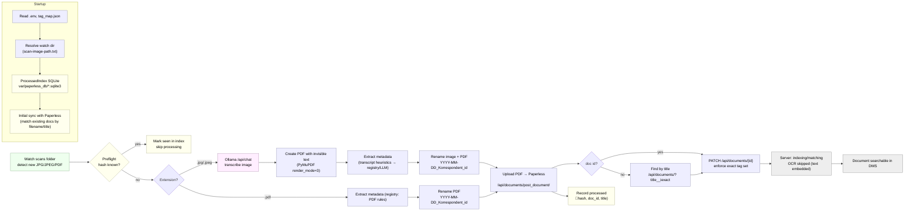
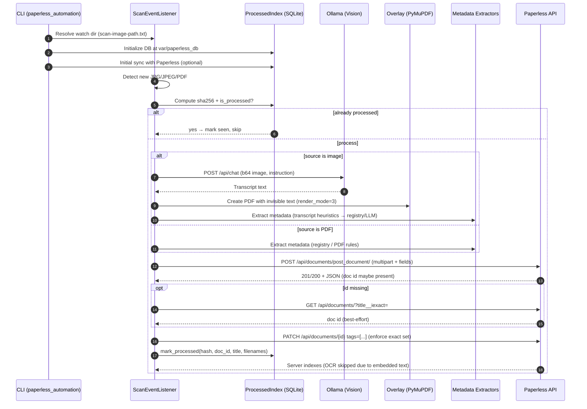
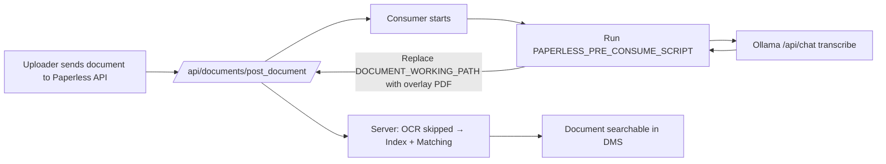
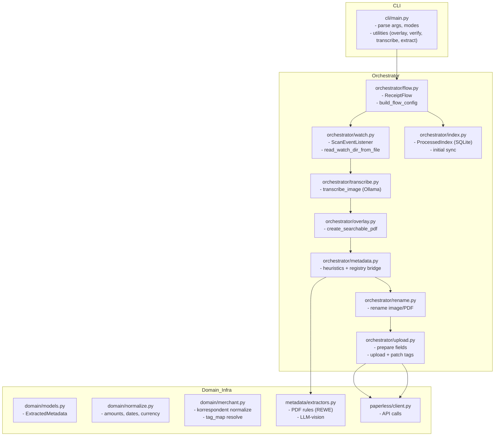

## Flowchart — Local Orchestration (Current Code)

```mermaid
flowchart LR
    subgraph Startup
        ENV[Read .env, tag_map.json]:::cfg
        WD[Resolve watch dir<br/>#40;scan-image-path.txt#41;]:::cfg
        IDX0[ProcessedIndex SQLite<br/>var/paperless_db/*.sqlite3]:::idx
        SYNC[Initial sync with Paperless<br/>#40;match existing docs by filename/title#41;]:::idx
        ENV --> WD --> IDX0 --> SYNC
    end

    W[Watch scans folder<br/>detect new JPG/JPEG/PDF]:::watch --> H{Preflight<br/>hash known?}:::idx
    H -- yes --> SKIP[Mark seen in index<br/>skip processing]:::idx
    H -- no --> EXT{Extension?}

    EXT -- .pdf --> M2[Extract metadata #40;registry: PDF rules#41;]:::meta
    EXT -- .jpg/.jpeg --> T[Ollama /api/chat<br/>transcribe image]:::ollama
    T --> O[Create PDF with invisible text<br/>#40;PyMuPDF render_mode=3#41;]:::overlay
    O --> M1[Extract metadata<br/>#40;transcript heuristics → registry/LLM#41;]:::meta

    M1 --> R1[Rename image + PDF<br/>YYYY-MM-DD_Korrespondent_id]:::fs
    M2 --> R2[Rename PDF<br/>YYYY-MM-DD_Korrespondent_id]:::fs
    R1 --> U
    R2 --> U

    U[Upload PDF → Paperless
    /api/documents/post_document/]:::api --> RES{doc id?}
    RES -- yes --> PATCH[PATCH /api/documents/#123;id#125;
    enforce exact tag set]:::api
    RES -- no --> FIND[Find by title
    /api/documents/?title__iexact]:::api --> PATCH

    PATCH --> IDX[Server: indexing/matching
    OCR skipped #40;text embedded#41;]:::srv
    IDX --> DONE[Document searchable in DMS]:::srv
    U --> REC[Record processed
    #01;hash, doc_id, title#41;]:::idx

    classDef cfg fill:#eef,stroke:#88a,color:#000
    classDef watch fill:#efe,stroke:#8a8,color:#000
    classDef idx fill:#ffe,stroke:#aa8,color:#000
    classDef ollama fill:#fef,stroke:#a8a,color:#000
    classDef overlay fill:#eef,stroke:#88a,color:#000
    classDef meta fill:#eef,stroke:#88a,color:#000
    classDef fs fill:#eef,stroke:#88a,color:#000
    classDef api fill:#eef,stroke:#88a,color:#000
    classDef srv fill:#eee,stroke:#888,color:#000
```

## Sequence — Local Orchestration (Current Code)

```mermaid
sequenceDiagram
    autonumber
    participant CLI as CLI (paperless_automation)
    participant Watch as ScanEventListener
    participant IdxDB as ProcessedIndex (SQLite)
    participant Ollama as Ollama (Vision)
    participant PDF as Overlay (PyMuPDF)
    participant Meta as Metadata Extractors
    participant P as Paperless API

    CLI->>Watch: Resolve watch dir (scan-image-path.txt)
    CLI->>IdxDB: Initialize DB at var/paperless_db
    CLI->>IdxDB: Initial sync with Paperless (optional)

    Watch->>Watch: Detect new JPG/JPEG/PDF
    Watch->>IdxDB: Compute sha256 + is_processed?
    alt already processed
        IdxDB-->>Watch: yes → mark seen, skip
    else process
        alt source is image
            Watch->>Ollama: POST /api/chat (b64 image, instruction)
            Ollama-->>Watch: Transcript text
            Watch->>PDF: Create PDF with invisible text (render_mode=3)
            Watch->>Meta: Extract metadata (transcript heuristics → registry/LLM)
        else source is PDF
            Watch->>Meta: Extract metadata (registry / PDF rules)
        end
        Watch->>P: POST /api/documents/post_document/ (multipart + fields)
        P-->>Watch: 201/200 + JSON (doc id maybe present)
        opt id missing
            Watch->>P: GET /api/documents/?title__iexact=
            P-->>Watch: doc id (best-effort)
        end
        Watch->>P: PATCH /api/documents/{id} tags=[...] (enforce exact set)
        Watch->>IdxDB: mark_processed(hash, doc_id, title, filenames)
        P-->>Watch: Server indexes (OCR skipped due to embedded text)
    end
```

## Alternative — Pre‑Consume Hook (Paperless)

```mermaid
flowchart LR
    A[Uploader sends document to Paperless API] --> B[/api/documents/post_document/]
    B --> C[Consumer starts]
    C --> H[Run PAPERLESS_PRE_CONSUME_SCRIPT]
    H --> V[Ollama /api/chat transcribe]:::ollama
    V --> H
    H -->|Replace DOCUMENT_WORKING_PATH with overlay PDF| B
    B --> IDX[Server: OCR skipped → Index + Matching]
    IDX --> D[Document searchable in DMS]
```

## Components — Modules & Responsibilities

```mermaid
flowchart TB
  subgraph CLI
    CM[cli#47;main#46;py<br/>- parse args#44; modes<br/>- utilities #40;overlay#44; verify#44; transcribe#44; extract#41;]
  end

  subgraph Orchestrator
    F[orchestrator#47;flow#46;py<br/>- ReceiptFlow<br/>- build_flow_config]
    W[orchestrator#47;watch#46;py<br/>- ScanEventListener<br/>- read_watch_dir_from_file]
    TR[orchestrator#47;transcribe#46;py<br/>- transcribe_image #40;Ollama#41;]
    OV[orchestrator#47;overlay#46;py<br/>- create_searchable_pdf]
    MD[orchestrator#47;metadata#46;py<br/>- heuristics #43; registry bridge]
    RN[orchestrator#47;rename#46;py<br/>- rename image#47;PDF]
    UP[orchestrator#47;upload#46;py<br/>- prepare fields<br/>- upload #43; patch tags]
    IX[orchestrator#47;index#46;py<br/>- ProcessedIndex #40;SQLite#41;<br/>- initial sync]
  end

  subgraph Domain_Infra
    M[domain#47;models#46;py<br/>- ExtractedMetadata]
    N[domain#47;normalize#46;py<br/>- amounts#44; dates#44; currency]
    G[domain#47;merchant#46;py<br/>- korrespondent normalize<br/>- tag_map resolve]
    R[metadata#47;extractors#46;py<br/>- PDF rules #40;REWE#41;<br/>- LLM-vision]
    P[paperless#47;client#46;py<br/>- API calls]
  end

  CM --> F
  F --> W --> TR --> OV --> MD --> RN --> UP --> P
  F --> IX
  MD --> R
  UP --> P
```

