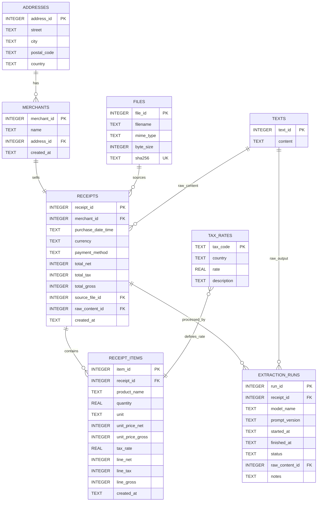

# Product Database Plan

This document holds the plan of creating a correct and accurate product database with additional information based on my receipts using LLMs with vision 
capabilities.

## Models to use

- GPT-5 via API through to good performance and cheap costs especially with the gpt-5-mini model (or nano)

## What data to track

- Product name
- Product amount
- Product price
- Mehrwertteuer for Product (7% or 19%)
- Date of buying
- Time of buying
- Merchant
- Address of merchant (City, Street, Postalcode, Country)
- Currency
- Paid with cash or card

## Database Schema

PRAGMA foreign_keys = ON;

-- 1) Address book
CREATE TABLE addresses (
  address_id   INTEGER PRIMARY KEY,
  street       TEXT,
  city         TEXT,
  postal_code  TEXT,
  country      TEXT
);

CREATE TABLE merchants (
  merchant_id  INTEGER PRIMARY KEY,
  name         TEXT NOT NULL,
  address_id   INTEGER REFERENCES addresses(address_id) ON UPDATE CASCADE ON DELETE SET NULL,
  created_at   TEXT DEFAULT (datetime('now')),
  UNIQUE(name, address_id)
);

-- 2) Artifacts
CREATE TABLE files (
  file_id    INTEGER PRIMARY KEY,
  filename   TEXT NOT NULL,
  mime_type  TEXT,
  byte_size  INTEGER,
  sha256     TEXT UNIQUE
);

CREATE TABLE texts (
  text_id    INTEGER PRIMARY KEY,
  content    TEXT NOT NULL           -- raw JSON (string)
);

-- 3) Receipt header
CREATE TABLE receipts (
  receipt_id        INTEGER PRIMARY KEY,
  merchant_id       INTEGER NOT NULL REFERENCES merchants(merchant_id) ON UPDATE CASCADE ON DELETE RESTRICT,
  purchase_date_time TEXT NOT NULL,   -- "YYYY-MM-DDTHH:MM:SS"
  currency          TEXT NOT NULL CHECK(length(currency)=3),
  payment_method    TEXT NOT NULL CHECK (payment_method IN ('CASH','CARD','OTHER')),
  -- prefer INTEGER cents; if you stay with REAL, keep them >= 0
  total_net         INTEGER,          -- cents; NULL if unknown
  total_tax         INTEGER,
  total_gross       INTEGER,
  source_file_id    INTEGER REFERENCES files(file_id) ON DELETE SET NULL,
  raw_content_id    INTEGER REFERENCES texts(text_id) ON DELETE SET NULL,
  created_at        TEXT DEFAULT (datetime('now')),
  UNIQUE(merchant_id, purchase_date_time)
);

-- 4) Line items
CREATE TABLE receipt_items (
  item_id          INTEGER PRIMARY KEY,
  receipt_id       INTEGER NOT NULL REFERENCES receipts(receipt_id) ON DELETE CASCADE,
  product_name     TEXT NOT NULL,
  quantity         REAL NOT NULL CHECK(quantity > 0),
  unit             TEXT,               -- "x","kg","l"
  unit_price_net   INTEGER,            -- cents (nullable)
  unit_price_gross INTEGER,            -- cents (nullable)
  tax_rate         REAL NOT NULL CHECK(tax_rate IN (0.00, 0.07, 0.19)),
  line_net         INTEGER,            -- cents
  line_tax         INTEGER,            -- cents
  line_gross       INTEGER,            -- cents
  created_at       TEXT DEFAULT (datetime('now')),
  CHECK(line_net    IS NULL OR line_net    >= 0),
  CHECK(line_tax    IS NULL OR line_tax    >= 0),
  CHECK(line_gross  IS NULL OR line_gross  >= 0)
);

-- 5) Extraction runs
CREATE TABLE extraction_runs (
  run_id         INTEGER PRIMARY KEY,
  receipt_id     INTEGER REFERENCES receipts(receipt_id) ON DELETE CASCADE,
  model_name     TEXT NOT NULL,
  prompt_version TEXT,
  started_at     TEXT DEFAULT (datetime('now')),
  finished_at    TEXT,
  status         TEXT CHECK (status IN ('OK','WARN','ERROR')) DEFAULT 'OK',
  raw_content_id INTEGER REFERENCES texts(text_id) ON DELETE SET NULL,
  notes          TEXT
);

-- 6) VAT lookup (optional)
CREATE TABLE tax_rates (
  tax_code   TEXT PRIMARY KEY,  -- "DE_7","DE_19"
  country    TEXT NOT NULL,
  rate       REAL NOT NULL,     -- 0.07, 0.19, etc.
  description TEXT
);

-- Helpful indexes
CREATE INDEX idx_receipts_merchant_dt ON receipts(merchant_id, purchase_date_time);
CREATE INDEX idx_items_receipt        ON receipt_items(receipt_id);
CREATE INDEX idx_items_taxrate        ON receipt_items(tax_rate);
CREATE INDEX idx_merchants_name       ON merchants(name);

## Workflow

  0. Create the database and tables with the described schema.
  1. Parse the receipt (image) with a good prompt to the openai model (gpt-5-mini) and advice the model to output a valid json.
    1.1. For each table a seperate prompt to get a response for each table? => Easier to parse and probably easier for the model because model is more focused!? But maybe more expensive and slower due to multiple calls?
    1.2. One prompt and one response for all data? Maybe less tokens (cheaper) and also faster. But harder to parse and accuracy maybe not good enough?
  2. Parse the json and validate data for correctness.
  3. Insert into database.
  4. Final validation. 

## Implementation plan

  1. Find a good place in my repo for that whole process and make the dir(s).
  2. Create the necessary file(s) for this with boilerplate classes/methods/functions etc. that are all necessary. Make it fit perfect into my current structure, make it
  easy to read, maintain and scale while also being modular.
  3. Implement all the actual functionality with a file for testing/debugging on an example document to see the actual results from the model.
  4. If results are good and every functionality is implemented then integrate this into the main paperless_automation flow.
    4.1. Append this at the end of my flow. -> When document is renamed and uploaded to paperless, start this detailed receipt data extraction with the openai model.
  
  Notes: Keep good and helpfull logging in the current style. Reuse components if already implemented and applicable. Use openai_api_key from .env in root dir. 